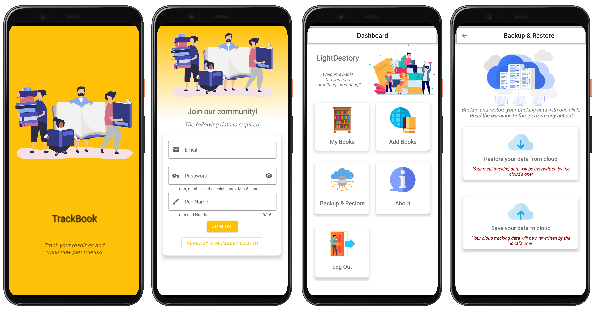

# :cloud: TrackBook Application (front-end Android)  

This repository hosts the source code of the android application of my TrackBook project.

## :zap: Features

- Cloud-based: Create an account and save your tracking on the cloud
- Scan ISBN easily
- Scan Book title
- Easy UI
- Shake phone to track your reading state

## :heart: Powered By

The application is not very complex but *I tried to use modern developing techniques* such as:

- **Kotlin**, a modern and powerful programming language developed by JetBrains and based on JVM;
- **Material Design**, Google's UI/UX standards;
- **Volley**, it is a minimal and simple HTTP request client developed by Google for Android.
- **GSON**, it is a powerful library to serialize and deserialize Object to and from json format.
- **ZXing**, it is a multi-format code scanner library.
- **Google ML kit**, it is a machine learning kit for _on device_ OCR feature.
- **Pattern Design**, learned during Software engeering course.
## :gear: Setup

You must fulfill the prerequisites before building the application:

- *Android Studio* 4.x
- *Android SDK* it is based on 30 but the minSDK is set to 25

If you got everything, we can start building:

1) Import the repository folder on Android Studio.
2) Sync gradle settings and dependecies.
3) Make your changes and test with debug builds
4) Make your own keystore and build a *signed* apk

